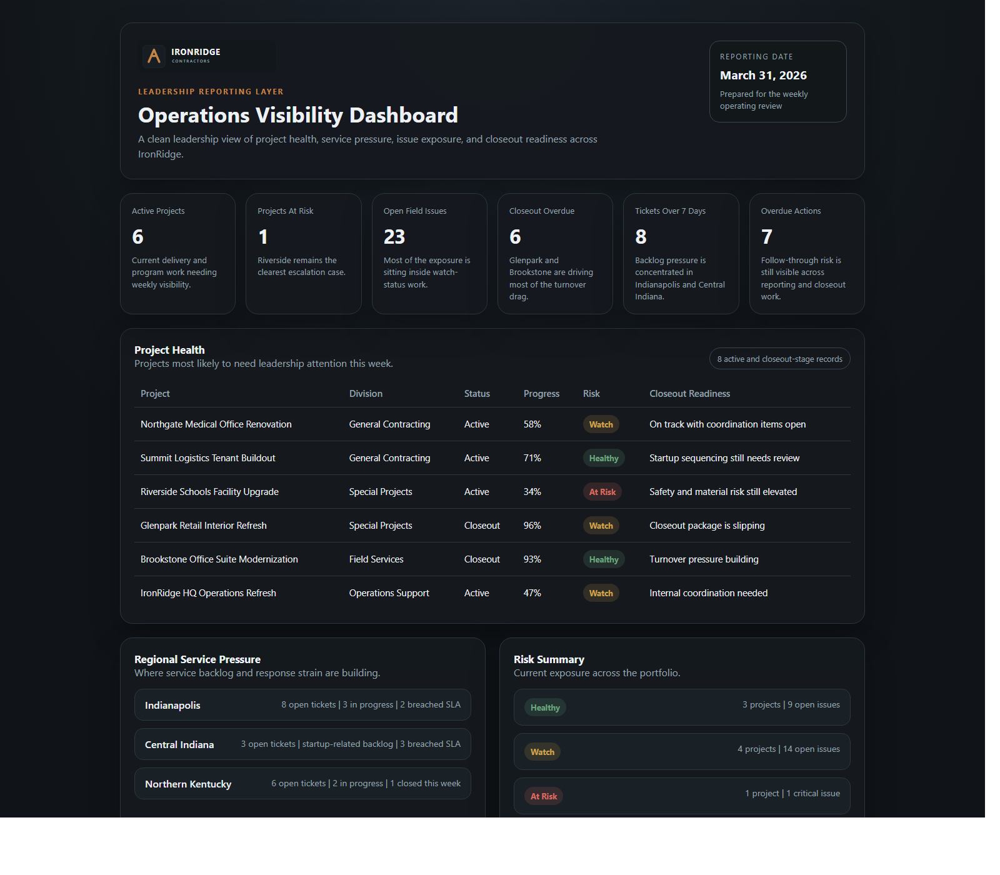
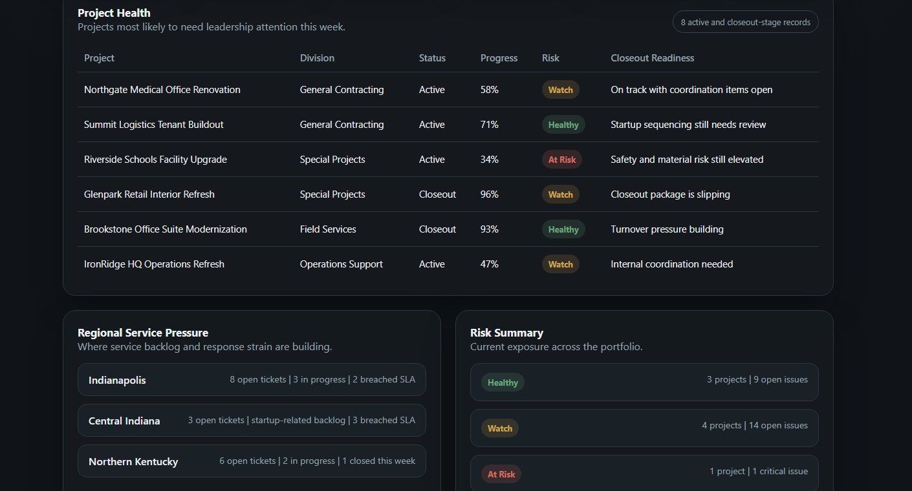

# IronRidge Operations Visibility Dashboard

## Overview

This is the executive-facing layer of the IronRidge portfolio.

It shows what cleaner leadership reporting can look like when project health, service pressure, closeout exposure, and operational risk stop living in separate conversations. The point is not a flashy BI build. The point is a reporting view that helps leaders see the business faster and talk about the right things sooner.

## Business Problem

IronRidge does not have a lack-of-effort problem. It has a visibility problem that comes with growth.

Project updates live in PM trackers. Service work gets rolled up differently by team. Closeout trouble shows up late. Risk sits in side conversations longer than it should. Leadership can still get the story, but too often they have to reconstruct it by hand.

## What This Repo Adds

This repo pulls connected sample data from projects, service activity, field issues, closeout items, and action tracking into a reporting-ready layer.

The result is a dashboard concept that reads like something an operations or executive review could actually use: fewer moving parts, clearer signals, and less time spent chasing context before a meeting.

## Screenshots

### Overview

### Detail View

## Ecosystem Context

This repo is the top reporting layer inside the wider IronRidge environment.

The other repos supply the operational detail behind the numbers:
- `workflow-drag-reduction-demo` shows how work enters the system through intake, routing, and approvals
- `execution-infrastructure-demo` shows how ownership, blockers, and follow-through are kept visible
- `contractor-ops-system-demo` shows the field and closeout conditions that eventually surface as leadership risk

Together they read like one contractor operating environment instead of four disconnected demos.

## Repository Structure

- `docs/` business framing, architecture notes, KPI definitions, and ecosystem context
- `data/raw/` fictional but connected operational records
- `data/curated/` summary tables shaped for reporting
- `data/sample_exports/` simple export examples
- `src/dashboard-mock/` static dashboard mock for walkthroughs and screenshots
- `assets/` shared IronRidge visual assets
- `notes/` roadmap and screenshot planning notes

## Data And Sample Assets

The data is fictional, but the pressure is familiar. Projects, service tickets, field issues, closeout items, and action records all sit inside the same IronRidge context used across the rest of the portfolio.

The curated layer is where the reporting story tightens up. It gives leaders a view of project condition, backlog pressure, issue exposure, and closeout readiness without pretending a heavy application build is required to make the point.

## Mock Experience

The mock dashboard is meant to be the cleanest visual artifact in the ecosystem.

It should read like an internal leadership screen: calm, readable, and built around what needs attention now. The page stays intentionally lightweight so it is easy to use for screenshots, walkthroughs, and portfolio review.

## Future Enhancements

- connect curated CSVs to lightweight client-side filtering
- add trend views for backlog, closeout pressure, and risk movement
- introduce division-specific and leadership-specific views
- expand KPI documentation with source logic and refresh assumptions

## Fictional Demo Notice

This repository is part of a fictional IronRidge Contractors environment built to show reporting, workflow, execution, and field operations design. The names and records are made up. The business patterns are not.
